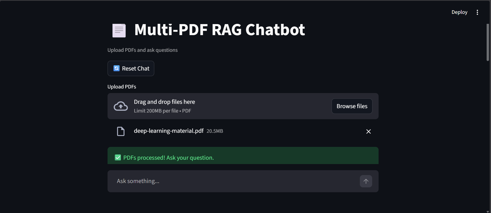
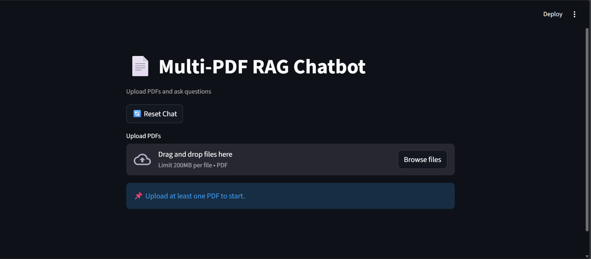
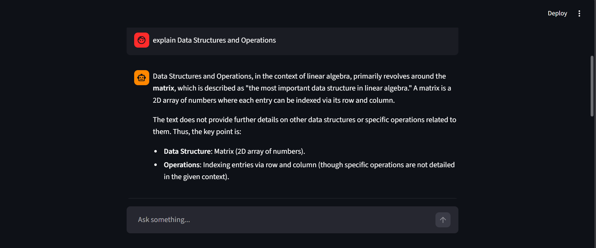

#  RAG Chatbot with Multi-PDF Support + Chat Memory

A **Retrieval-Augmented Generation (RAG)** based chatbot that allows users to upload PDFs and ask questions.
The system uses **vector search + LLM + conversational memory** to generate accurate, context-aware responses.

---

##  Features

*  **Multi-PDF Upload**
*  **Semantic Search (Chroma Vector DB)**
*  **Context-Aware Responses (RAG)**
*  **Chat Memory (Conversation History)**
*  **Source Attribution (see which file answer came from)**
*  **Streamlit UI (ChatGPT-style interface)**

---

## 🖼️ Demo Screenshots

### 🔹 Upload PDFs



### 🔹 Chat Interface



### 🔹 Answer with Sources



>  Create a folder named `screenshots/` in your repo and add images there.

---

##  How It Works

```text
User Query
   ↓
Retriever (Chroma DB)
   ↓
Relevant Chunks (Context)
   +
Chat History
   ↓
LLM (Mistral)
   ↓
Final Answer
```

---

##  Tech Stack

* **Frontend:** Streamlit
* **LLM:** Mistral (via LangChain)
* **Embeddings:** HuggingFace (`all-MiniLM-L6-v2`)
* **Vector DB:** Chroma
* **Framework:** LangChain

---

##  Project Structure

```text
RAG/
│── app.py
│── main.py
│── create_db.py
│── screenshots/        # 📸 add images here
│── chroma_db/
│── .env
│── README.md
```

---

##  Setup Instructions

### 1️. Clone the repository

```bash
git clone <your-repo-url>
cd RAG
```

---

### 2️. Create virtual environment

```bash
python -m venv .venv
.\.venv\Scripts\activate
```

---

### 3️. Install dependencies

```bash
pip install -r requirements.txt
```

---

### 4️. Add environment variables

Create `.env` file:

```env
MISTRAL_API_KEY=your_api_key_here
```

---

### 5️. Run the application

```bash
streamlit run app.py
```

---

##  Usage

1. Upload one or more PDF files
2. Ask questions in natural language
3. View answers along with **source documents**
4. Continue conversation — system remembers context

---

##  Example Queries

* *What is Java?*
* *Explain OOP concepts from the document*
* *What are its features?*

---

##  Key Concepts

###  RAG (Retrieval-Augmented Generation)

* Vector search (relevant chunks)
* LLM reasoning

---

### 🔹 Chat Memory

* Multi-turn conversations
* Context-aware answers

---

### 🔹 Metadata Usage

```python
doc.metadata["source"] = file.name
```

---

##  Future Improvements

*  Streaming responses
*  Hybrid search
*  Query rewriting
*  Persistent DB
*  FastAPI backend
*  Docker Deployment

---

##  Use Cases

* Document QA systems
* Knowledge assistants
* Research tools
* Portfolio project
* 
